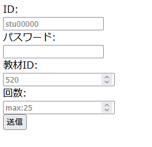
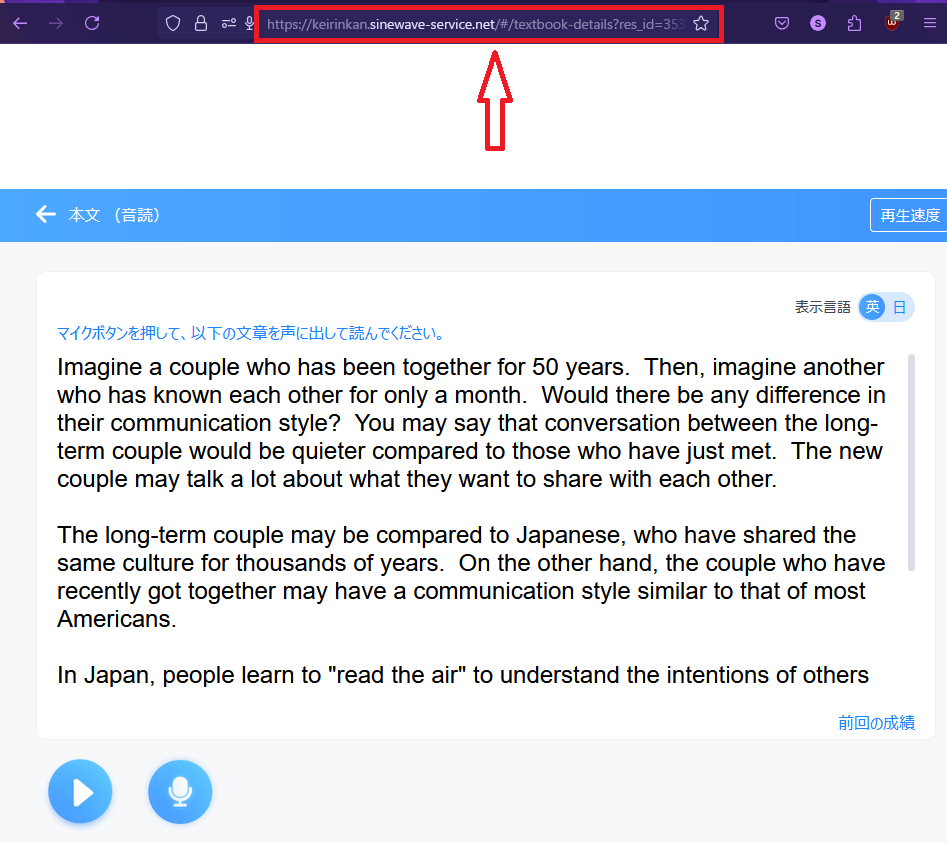
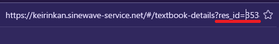
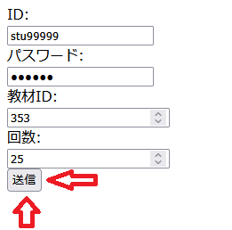
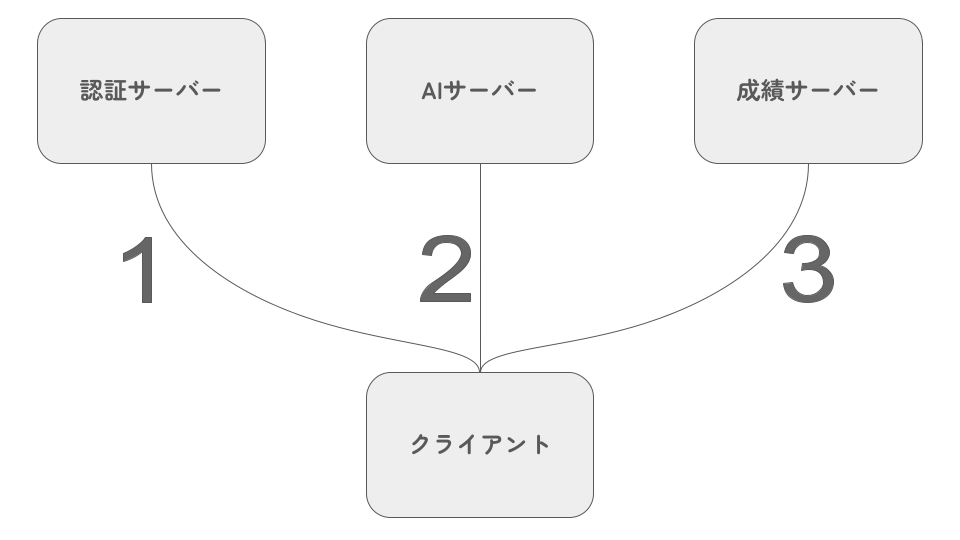
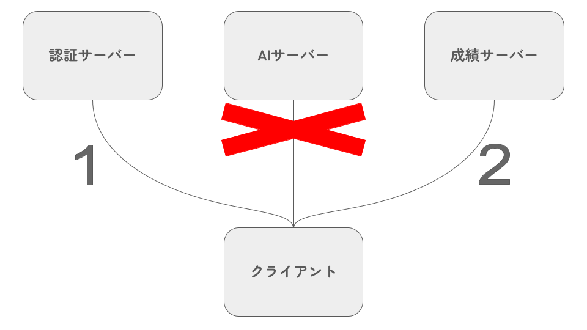

# Poker4PS
P0cket Spe4kingの成績を自動で追加するツール。
[>ツールはここ<](./tool.html)

## 使い方

### P0cket Spe4king(以下PS)の**アカウントID**と**パスワード**を上2段に入力し、  
### 一番下に成績を追加する回数を入力します。

### 「教材ID」は、LessonとSectionの指定です。  
### PSを開いて特定のLesson,Sectionを開いた上でURLを見ると教材IDが分かります。

(←この場合は353)  
  
### 全ての入力が終わったらあとは送信ボタンを押すだけです！  
### 一瞬ロード画面が出たらあなたの課題は既に終わっています。

## 仕組み
PSのサーバーに対して正規の手順でログインして、成績保存サーバーに直接アクセスして認証情報を渡してAPIを叩いているだけです。  
JavaScriptは苦手なので中々汚いとは思いますが分かる人は`tool.html`の中を覗いてみてください。

  
  
本来正規のサイトでは音声をAIサーバーで採点した後にその結果を成績サーバーに送信するのですが、(上画像)  
何故かAIサーバーを通した正規の採点手順を踏まなくても成績サーバーに成績が追加できるので、  
自分で好きに作った成績データを直接成績サーバーに送信する仕組みになっています。(下画像)